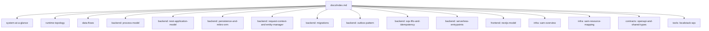

# 컨셉 맵

이 페이지는 문서의 시각적 목차입니다.

```mermaid
graph TD
  IDX[docs/index.md]

  IDX --> O1[system-at-a-glance]
  IDX --> O2[runtime-topology]
  IDX --> O3[data-flows]

  IDX --> B1[backend: process-model]
  IDX --> B2[backend: nest-application-model]
  IDX --> B3[backend: persistence-and-mikro-orm]
  IDX --> B4[backend: request-context-and-entity-manager]
  IDX --> B5[backend: migrations]
  IDX --> B6[backend: outbox-pattern]
  IDX --> B7[backend: sqs-fifo-and-idempotency]
  IDX --> B8[backend: serverless-entrypoints]

  IDX --> F1[frontend: nextjs-model]

  IDX --> I1[infra: sam-overview]
  IDX --> I2[infra: sam-resource-mapping]

  IDX --> C1[contracts: openapi-and-shared-types]

  IDX --> T1[tools: localstack-sqs]
```
