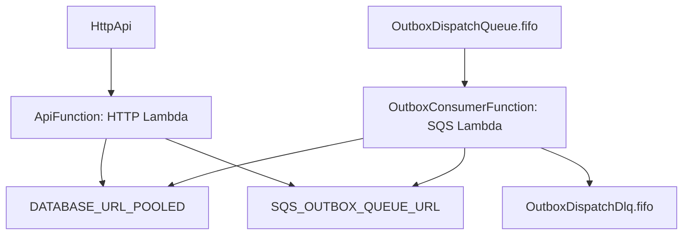

# SAM 리소스 매핑

이 문서는 SAM 템플릿의 리소스가 런타임 관점에서 무엇을 의미하는지, 그리고 애플리케이션 엔트리포인트와 어떻게 연결되는지 소개합니다.

## 개요

SAM 템플릿은 “인프라 리소스”와 “애플리케이션 핸들러”를 연결하는 선언입니다.

## 이 저장소에서의 형태(개념)

## 참고

현재 템플릿의 코드 경로(`CodeUri`)나 핸들러 경로는 저장소의 폴더 구조 변화에 따라 맞춤 수정이 필요할 수 있습니다.

## 함께 읽기

- [서버리스 엔트리포인트](../backend/serverless-entrypoints.md)
- [SAM 개요](sam-overview.md)
