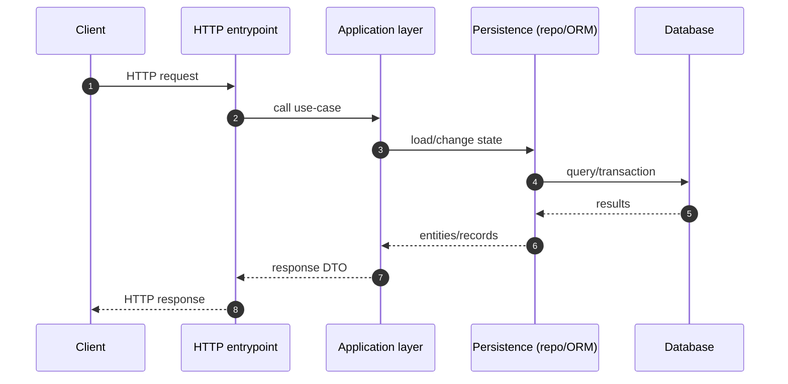
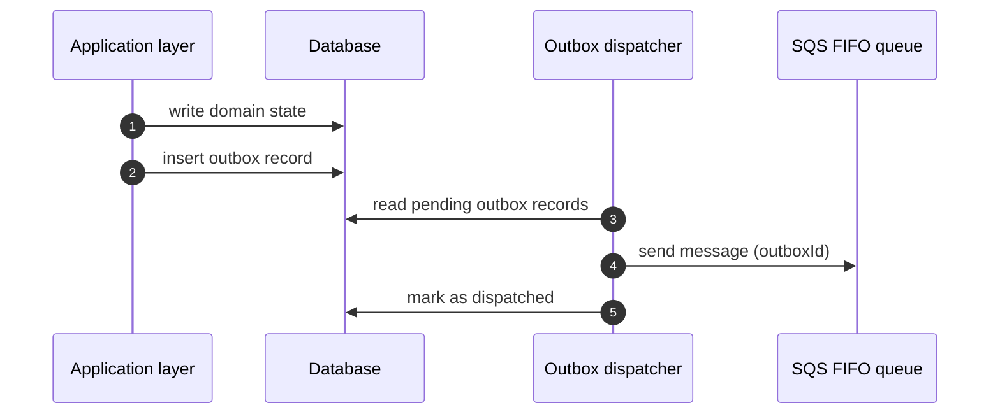
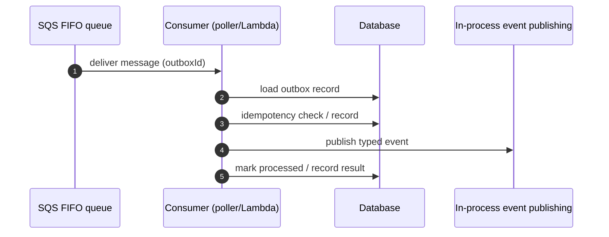

# Data Flows

This document introduces the main technical flows that appear in this repository: HTTP handling and outbox-based async processing.

## HTTP request flow (conceptual)

## Outbox dispatch flow (DB → queue)

## Async consume flow (queue → worker)

## Related docs

- [Outbox Pattern](concepts/backend/outbox-pattern.md)
- [SQS, FIFO, and Idempotency](concepts/backend/sqs-fifo-and-idempotency.md)
- [RequestContext and EntityManager](concepts/backend/request-context-and-entity-manager.md)
