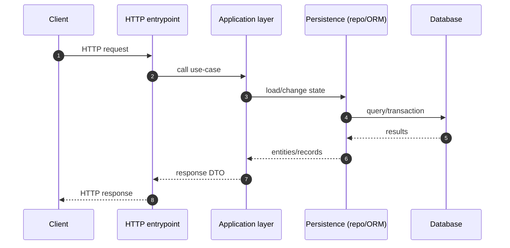
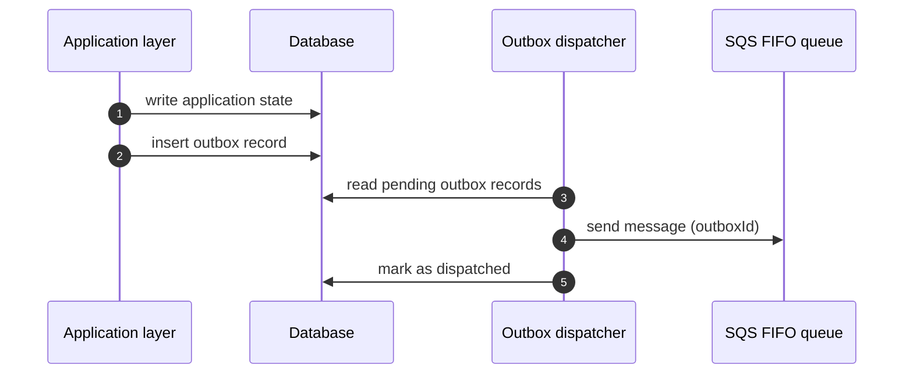
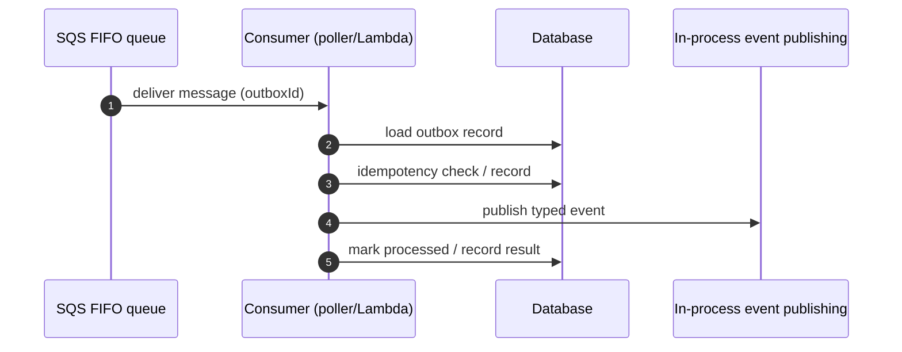

# 데이터 흐름

이 문서는 본 저장소에서 반복적으로 등장하는 기술적 흐름(HTTP 처리, Outbox 기반 비동기 처리)을 소개합니다.

## HTTP 요청 흐름(개념)

## Outbox 디스패치 흐름(DB → 큐)

## 비동기 소비 흐름(큐 → 워커)

## 관련 문서

- [Outbox 패턴](concepts/backend/outbox-pattern.md)
- [SQS FIFO와 멱등성](concepts/backend/sqs-fifo-and-idempotency.md)
- [RequestContext와 EntityManager](concepts/backend/request-context-and-entity-manager.md)
