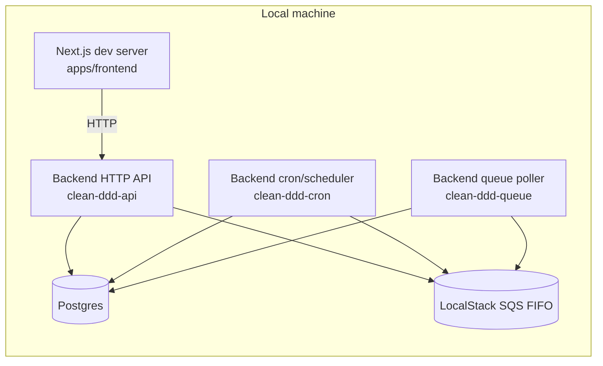
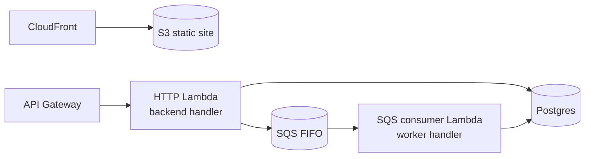

# Runtime Topology

This document describes where code runs in local development and in AWS, and how the pieces connect.

## Local topology

Local development uses Docker for supporting services and PM2 to run multiple backend roles.

Names such as `clean-ddd-api`, `clean-ddd-cron`, and `clean-ddd-queue` come from the PM2 configuration.

## AWS topology (conceptual)

The AWS shape mirrors the same roles using API Gateway, Lambda, and SQS.

## Related docs

- [Process Model](concepts/backend/process-model.md)
- [SAM Overview](concepts/infra/sam-overview.md)
- [Serverless Entrypoints](concepts/backend/serverless-entrypoints.md)
