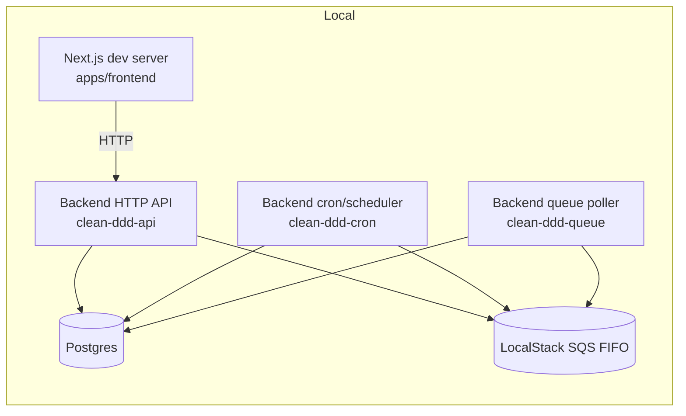
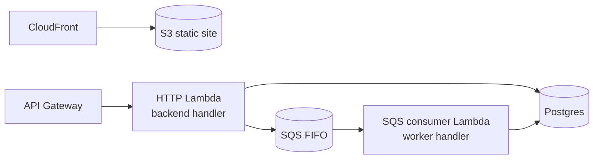

# 런타임 토폴로지

이 문서는 로컬 개발 환경과 AWS 환경에서 코드가 어디에서 실행되고, 각 구성요소가 어떻게 연결되는지 소개합니다.

## 로컬 토폴로지

로컬 개발에서는 Docker로 보조 서비스를 띄우고, PM2로 백엔드의 여러 실행 역할을 구동합니다.

`clean-ddd-api`, `clean-ddd-cron`, `clean-ddd-queue` 같은 프로세스 이름은 PM2 설정에서 정의됩니다.

## AWS 토폴로지(개념)

AWS에서도 역할은 유사하며, API Gateway/Lambda/SQS로 매핑됩니다.

## 관련 문서

- [프로세스 모델](concepts/backend/process-model.md)
- [SAM 개요](concepts/infra/sam-overview.md)
- [서버리스 엔트리포인트](concepts/backend/serverless-entrypoints.md)
