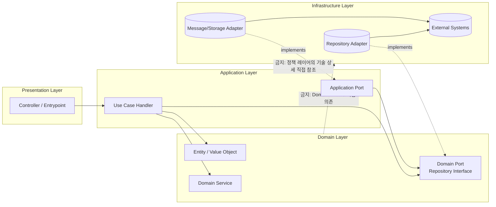
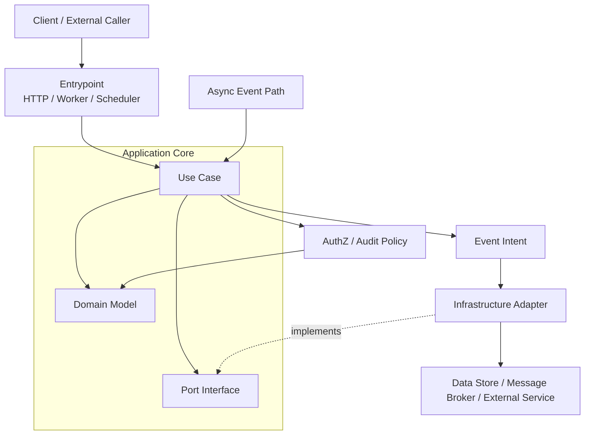

# Clean Architecture + DDD (백엔드 통합)

이 문서는 `clean-ddd` 백엔드의 핵심 설계 원칙을 **개념 정의 + 코드 구조 매핑** 관점으로 정리한 기준 문서입니다.

 
 

## 목차

1. [왜 이 구조를 쓰는가](#왜-이-구조를-쓰는가)
2. [핵심 개념 정의](#핵심-개념-정의)
3. [레이어 책임과 의존성](#레이어-책임과-의존성)
4. [레이어 의존성 다이어그램 (DIP)](#레이어-의존성-다이어그램-dip)
5. [시스템 구조 다이어그램](#시스템-구조-다이어그램)
6. [Shared vs Common 경계](#shared-vs-common-경계)
7. [개념 ↔ 폴더 매핑](#개념--폴더-매핑)
8. [핸들러/리포지토리 경계 규칙](#핸들러리포지토리-경계-규칙)
9. [Read 전략 기준](#read-전략-기준)
10. [기술 구현 관점: 애플리케이션 실행 모델](#기술-구현-관점-애플리케이션-실행-모델)
11. [기술 구현 관점: Outbox + SQS FIFO](#기술-구현-관점-outbox--sqs-fifo)
12. [테스트 전략](#테스트-전략)
13. [레이어드(DIP) vs 클린 선택 기준](#레이어드dip-vs-클린-선택-기준)
14. [빠른 자기 점검 체크리스트](#빠른-자기-점검-체크리스트)

 
 

## 왜 이 구조를 쓰는가

이 구조의 핵심 목적은 **잦은 변경에도 강인한 시스템을 만들고, 도메인 응집도를 극대화하며 결합도를 낮추는 것**입니다.

1. 인프라로부터 독립된 비즈니스 코어 확보 (DIP)

- DB/스토리지/메시징 제품이 바뀌어도 핵심 비즈니스 규칙은 유지되어야 합니다.
- 이를 위해 Domain/Application은 추상화(Port)에 의존하고, 상세 구현은 Adapter로 분리합니다.

2. 비즈니스 복잡도를 제어하는 풍부한 도메인 모델 (Rich Domain Model)

- 규칙과 제약은 데이터 외부가 아닌 도메인 객체 내부에 응집시킵니다.
- 서비스 계층의 비대화를 막고 변경 영향 범위를 줄입니다.

3. 팀 간 소통 비용 최소화 (Ubiquitous Language)

- 코드가 문서가 되도록 도메인 용어를 메서드/유스케이스 이름에 반영합니다.
- 기획/개발/디자인 간 의미 해석 차이를 줄입니다.

4. 비즈니스 성장에 대응하는 확장성 (Scalability)

- 현재 구조를 유지하되, 필요 시 도메인 경계 단위로 분리 가능해야 합니다.
- Bounded Context와 의존성 방향을 명확히 설계해 분리 비용을 낮춥니다.

5. 아키텍처 수준의 보안 신뢰성 (Security by Design)

- 단순 설정 중심이 아니라 구조 레벨에서 요청 주체 검증을 일관되게 강제합니다.
- 인증/권한 규칙을 엔트리포인트와 애플리케이션 경계 전체에 통합합니다.

 
 

## 핵심 개념 정의

| 개념               | 이 문서에서의 의미                                      | 직접 반영되는 위치                                    |
| ------------------ | ------------------------------------------------------- | ----------------------------------------------------- |
| Clean Architecture | 비즈니스 규칙을 프레임워크/DB/메시징 세부 구현에서 분리 | `src/service/backend/src/modules/*`                   |
| DDD                | 도메인 규칙을 엔티티/유스케이스 중심으로 모델링         | `domains/`, `application/`                            |
| Use Case           | 한 개의 명령/조회 목적을 수행하는 애플리케이션 로직     | `application/commands`, `application/queries`         |
| Aggregate Root     | 변경 일관성의 경계가 되는 핵심 엔티티                   | `domains/entities/*`                                  |
| Repository         | Aggregate Root 영속화를 위한 추상화                     | `domains/repositories`, `infrastructure/repositories` |
| Outbox             | 상태 변경 이후 비동기 전달을 보장하는 브리지            | `lib/outbox`, queue consumer 영역                     |
| RequestContext     | 작업 단위별 EntityManager 스코프                        | HTTP 요청 / cron / queue 실행 경계                    |

> 개념(Concept) 관점에서는 기술 제품명이 아니라 책임 경계와 의존성 방향을 먼저 정의합니다.

 
 

## 레이어 책임과 의존성

| 레이어         | 책임                      | 포함 요소                         | 하지 말아야 할 것        |
| -------------- | ------------------------- | --------------------------------- | ------------------------ |
| Presentation   | 요청/응답 경계            | Controller, DTO                   | 도메인 규칙 직접 구현    |
| Application    | 유스케이스 오케스트레이션 | Command/Query/Event Handler       | ORM 세부 구현 의존       |
| Domain         | 순수 비즈니스 규칙        | Entity, Repository Interface      | 외부 SDK/프레임워크 참조 |
| Infrastructure | 기술 구현                 | Repository 구현, Queue/DB adapter | 유스케이스 정책 결정     |

의존성은 안쪽(Domain)으로 향해야 하며, 바깥 레이어가 안쪽 계약을 구현하는 방향을 유지합니다.

 
 

## 레이어 의존성 다이어그램 (DIP)

핵심은 “안쪽 레이어가 바깥 구현을 모르고, 바깥 레이어가 안쪽 계약을 구현”하는 역전 구조를 강제하는 것입니다.

 
 

## 시스템 구조 다이어그램

위 구조에서 동기/비동기는 “진입 경로”만 다르고, 정책 실행 지점(Application/Domain)과 의존성 규칙(DIP)은 동일하게 유지됩니다.

 
 

## Shared vs Common 경계

현재 저장소 기준에서 `shared`와 `common` 경계는 다음처럼 구분합니다.

- `common`: 기술적 공통 요소(프레임워크 독립 유틸/기초 타입)
- `shared`: 비즈니스 계약(Command/Query/Event, Reader DTO)

핵심 기준은 **"도메인 문맥이 없으면 이해 가능한가"** 입니다.

- 가능하면 `common`
- 도메인 언어가 들어가면 `shared`

### Shared / Common / Lib 배치 원칙 (Do/Don’t)

`shared`, `common`, `lib`는 재사용 대상이 아니라 **의존성 방향과 도메인 언어 포함 여부**로 구분합니다.

| 위치     | 두는 것(Do)                                                 | 두지 말아야 할 것(Don’t)                              |
| -------- | ----------------------------------------------------------- | ----------------------------------------------------- |
| `shared` | Command/Query/Event 계약, Reader DTO, 도메인 간 합의된 타입 | ORM Entity, framework provider, 특정 인프라 구현 의존 |
| `common` | 기술 공통 유틸, base type, 에러 추상화                      | 특정 도메인 용어가 포함된 규칙, 비즈니스 정책         |
| `lib`    | 런타임 어댑터(outbox/queue/lambda), 실행 경계 wiring        | 도메인 규칙 자체, aggregate 상태 전이 정책            |

 
 

## 레이어드(DIP) vs 클린 선택 기준

둘 다 의존성 역전(DIP)을 사용할 수 있지만, 결정적인 차이는 **데이터 모델 분리 수준**입니다.

| 구분               | 레이어드 + DIP                                | 클린 아키텍처                   |
| ------------------ | --------------------------------------------- | ------------------------------- |
| 비즈니스 계층 모델 | ORM/영속 모델을 함께 쓰는 경우가 많음         | 순수 도메인 모델(POJO) 유지     |
| 영속 의존성 영향   | DB 모델 변경 영향이 상위 계층에 전파되기 쉬움 | mapper/repository 경계에서 흡수 |
| 구현 비용          | 초기 개발 속도 빠름                           | 매핑/경계 설계 비용 추가        |
| 장기 유지보수      | 중간 규모까지는 실용적                        | 복잡 도메인/장수 서비스에 유리  |

실무 기준:

- CRUD 중심/짧은 수명 서비스면 레이어드 + DIP도 충분할 수 있습니다.
- 도메인 규칙이 복잡하고 변경 비용이 큰 시스템이면 클린 아키텍처가 유리합니다.

 
 

## 개념 ↔ 폴더 매핑

| 알고 싶은 것    | 먼저 볼 폴더                                       | 확인 포인트                       |
| --------------- | -------------------------------------------------- | --------------------------------- |
| 유스케이스 흐름 | `src/service/backend/src/modules/*/application`    | handler 입력/출력과 orchestration |
| 도메인 규칙     | `src/service/backend/src/modules/*/domains`        | entity 불변성/규칙                |
| DB 매핑/영속    | `src/service/backend/src/modules/*/infrastructure` | repository 구현, mapper/schema    |
| 런타임 어댑터   | `src/service/backend/src/lib`                      | lambda/queue/outbox 결합          |
| 테스트 전략     | `src/service/backend/tests`                        | unit/db/e2e 분리 기준             |

 
 

## 핸들러/리포지토리 경계 규칙

### Command Handler

- 상태 변경 유스케이스를 수행합니다.
- 도메인 규칙은 Entity/Domain Service를 통해 적용합니다.
- 외부 발행이 필요하면 Outbox 경계를 사용합니다.

### Query Handler

- 조회 유스케이스를 수행합니다.
- 조회 최적화가 필요한 경우 조회 전용 접근을 허용하되, 도메인 규칙 변경은 수행하지 않습니다.

### BFF 경계: Query 조합 + 제한적 Command 위임

BFF는 기본적으로 조회 조합(Query composition) 경계이지만, **도메인 규칙을 소유하지 않는 조건**에서 Command 위임을 허용할 수 있습니다.

허용 조건:

- BFF는 유효성/화면 조합 책임만 갖고, 상태 전이 규칙은 원 도메인 Command Handler가 소유합니다.
- 트랜잭션 경계/도메인 이벤트/Outbox 기록은 도메인 모듈 내부에서 수행합니다.
- BFF의 Command는 “새 정책”이 아니라 “기존 유스케이스 라우팅/위임”이어야 합니다.

금지 조건:

- BFF가 도메인 엔티티를 직접 변경하거나 repository를 직접 호출하는 것
- BFF에서 다중 도메인 상태 전이를 임의로 조합해 신규 정책을 만드는 것

### Repository

- Aggregate Root 저장/조회의 최소 인터페이스를 유지합니다.
- 조회 편의를 위해 범용 쿼리 저장소로 비대화하지 않습니다.

### DIP 표현 체크(핵심)

- Domain/Application은 구현체가 아니라 <strong>포트(Repository Interface)</strong> 에만 의존합니다.
- Infrastructure는 포트를 구현하는 **어댑터**로만 동작하며, 정책을 소유하지 않습니다.
- 모듈 wiring에서는 `Symbol/Interface -> Concrete` 바인딩으로 의존성 방향을 고정합니다.
- 즉, DB가 Postgres/Mongo로 나뉘어도 핵심은 저장소 종류가 아니라 **의존성 역전 구조 유지**입니다.

 
 

## Read 전략 기준

| 조회 대상             | 기본 선택      | 이유                    |
| --------------------- | -------------- | ----------------------- |
| Aggregate Root        | Repository     | 도메인 경계 일관성 유지 |
| 하위 엔티티 단독 조회 | 조회 전용 접근 | Repository 비대화 방지  |
| 복합 조회/통계        | 조회 전용 접근 | 성능/응답 구조 최적화   |

Read 모델은 성능 최적화 여지를 허용하되, 상태 변경 경로는 Command로 고정합니다.

### Read 의사결정 순서

1. 조회 대상이 Aggregate Root인가?
2. 맞다면 Repository를 우선 사용합니다.
3. 아니면(하위 엔티티/복합 조회/통계) 조회 전용 접근을 선택합니다.
4. 어떤 경우에도 Query에서 상태 변경을 수행하지 않습니다.

안티패턴:

- 조회 편의를 위해 Repository 인터페이스를 범용 조회 API로 비대화하는 것
- Query Handler에서 도메인 상태 전이를 수행하는 것

 
 

## 기술 구현 관점: 애플리케이션 실행 모델

Nest 애플리케이션은 역할에 따라 두 형태로 실행됩니다.

- HTTP 서버 실행: 포트 리스닝 활성화, API 요청/응답 처리
- 애플리케이션 컨텍스트 실행: 리스닝 없이 내부 작업(스케줄/폴링) 수행

역할 분리는 런타임 환경변수 기반으로 구성됩니다.

- `PORT_LISTEN`: HTTP 리스닝 여부
- `OUTBOX_CRON_ENABLED`: Outbox 디스패처/스케줄러 활성화 여부
- `OUTBOX_POLLING_ENABLED`: Queue 소비자 활성화 여부

핵심은 진입점만 분기하고 Application/Domain 경계는 동일하게 유지하는 것입니다.

 
 

## 기술 구현 관점: Outbox + SQS FIFO

Outbox는 “DB 기록 이후 메시지 전달”을 통해 동기 트랜잭션과 비동기 처리를 연결합니다.

1. 애플리케이션이 상태 변경과 outbox 레코드를 DB에 기록합니다.
2. 디스패처가 pending outbox를 읽어 SQS FIFO에 `outboxId`를 전송합니다.
3. 소비자가 `outboxId`로 레코드를 조회해 타입 이벤트로 발행합니다.

운영/로컬 엔드포인트 차이가 있어도 흐름 원칙은 동일합니다.

- 로컬(LocalStack)에서는 FIFO 일부 속성 제한을 고려한 우회 설정을 사용합니다.
- 소비 측은 처리 이력 기록으로 멱등성을 보장합니다.

 
 

## 테스트 전략

테스트는 “무엇을 설명하는가”를 기준으로 레이어를 나눕니다.

- `tests/units/**`: 외부 인프라 없이 성립하는 규칙/로직
- `tests/db/**`: 영속성 정합성
- `tests/*.e2e-spec.ts`: HTTP 경계를 포함한 E2E

필요 시 `tests/scenarios/**`를 도입해 조합/흐름 관점 테스트를 분리할 수 있습니다.

### 클린 아키텍처가 테스트를 단순화하는 이유

- Application은 인터페이스(Repository/Reader) 기반 주입으로 테스트 대상을 고립하기 쉽습니다.
- Domain은 프레임워크/ORM 의존이 없어 순수 규칙 테스트가 가능합니다.
- Infrastructure 변경(ORM/외부 SDK)이 Domain/Application 테스트에 미치는 영향을 줄입니다.

 
 

## Actor(AuthContext) 전파 원칙

요청 주체(Actor: 사용자/시스템 계정)는 `AuthContext`로 애플리케이션 경계에 주입하고, 하위 유스케이스는 이를 참조해 감사/권한/행위 주체를 일관되게 처리합니다.

- Controller/Entrypoint에서 Actor를 결정하고 컨텍스트를 설정합니다.
- Application/Domain은 HTTP 프레임워크 객체를 참조하지 않고 Actor 정보만 사용합니다.
- 비동기 경로(Queue/Cron)에서는 시스템 Actor를 명시해 동일 규칙을 유지합니다.

 
 

## RequestContext와 Unit of Work

`RequestContext`는 실행 단위(HTTP 요청 1회, cron 배치 1회, queue 메시지 1회)에 대해 EntityManager 스코프를 고정해 Unit of Work 일관성을 보장합니다.

- HTTP: 요청당 컨텍스트 1개를 생성해 같은 유스케이스 내 영속 일관성을 유지합니다.
- Cron/Worker: 반복 루프마다 독립 컨텍스트를 생성해 누적 오염을 방지합니다.
- Outbox 소비: lock/멱등성/상태 갱신을 동일 실행 컨텍스트에서 처리합니다.

실무 규칙:

- 루프 외부에서 공유된 EntityManager를 재사용하지 않습니다.
- 컨텍스트 경계와 재시도 경계를 일치시킵니다.
- 실패 기록(`attempt`, `nextAttemptAt`, `lastError`)은 같은 Unit of Work에서 갱신합니다.

 
 

## 빠른 자기 점검 체크리스트

- Handler에서 도메인 규칙이 아닌 인프라 세부 구현을 직접 다루지 않았는가?
- Repository 인터페이스가 조회 편의 기능으로 과도하게 비대해지지 않았는가?
- 비동기 발행 경로가 Outbox 경계를 거치도록 연결되어 있는가?
- HTTP, cron, queue 역할 차이가 애플리케이션 핵심 로직을 바꾸지 않는가?
- shared/common 경계가 도메인 언어 기준으로 분리되어 있는가?
