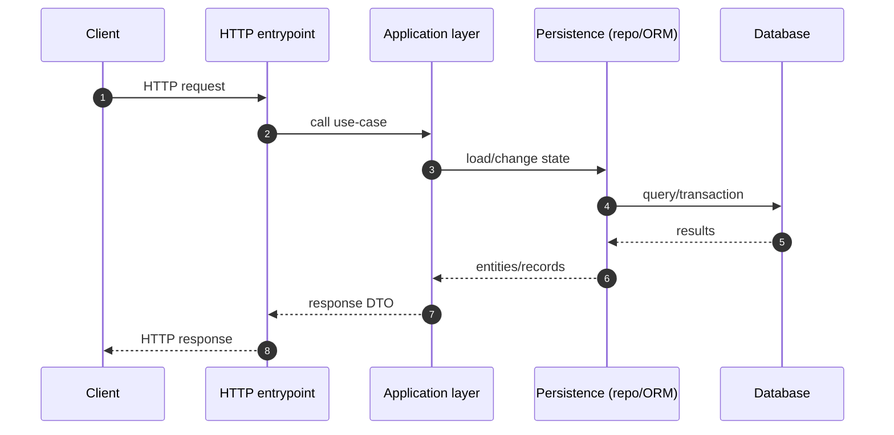
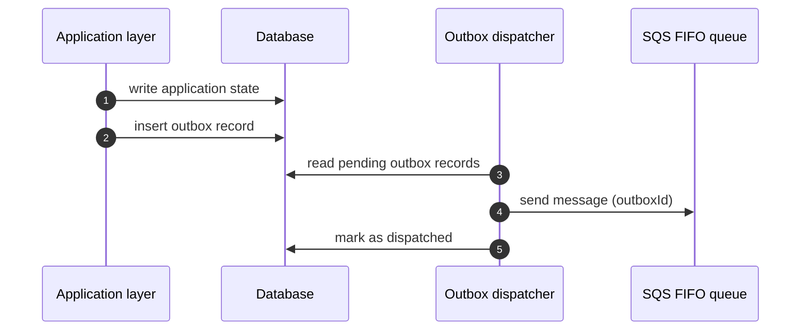
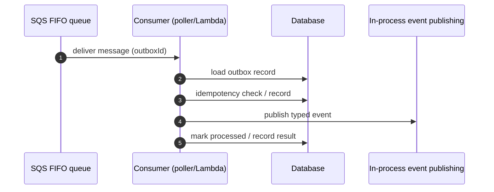

# 데이터 흐름

이 문서는 본 저장소에서 반복적으로 등장하는 핵심 기술 흐름(HTTP 처리, Outbox 기반 비동기 처리)을 소개합니다.

 
 

## HTTP 요청 흐름(개념)

 
 

## Outbox 디스패치 흐름(DB → 큐)

운영 기본값:

- AWS 배포에서는 outbox dispatcher가 scheduler Lambda로 실행되며 기본 스케줄은 `rate(1 minute)`입니다.
- 따라서 outbox row가 기록된 시점과 실제 SQS enqueue 시점 사이에는 최대 약 1분의 의도된 대기 시간이 생길 수 있습니다.
- 이 구간은 `OutboxDispatcher` 로그의 `dispatchLagMs`나 `OutboxConsumer` 로그의 `eventAgeMs`로 관찰할 수 있습니다.

 
 

## 비동기 소비 흐름(큐 → 워커)

실제 구현은 다음 컴포넌트로 분리됩니다.

- Producer: outbox 저장 (`OutboxProducer`)
- Dispatcher: pending outbox 조회 + SQS enqueue (`OutboxDispatcher`, `DispatchOutboxEventHandler`)
- Poller: SQS long polling + 메시지 delete (`OutboxSqsPoller`)
- Consumer: lock/멱등성/이벤트 발행/실패 기록 (`OutboxConsumer`)

로그 해석 팁:

- `PaymentFulfillmentRequestedHandler`, `ReserveInventoryForOrderHandler`, `CreateShipmentForOrderHandler` 같은 후속 처리 로그는 consumer 실행 컨텍스트 안에서 남기 때문에 `outbox-consumer` 로그 그룹에서 확인하는 것이 정상입니다.
- `OutboxDispatcher` 로그는 scheduler Lambda인 `outbox-dispatch` 로그 그룹에서 따로 확인해야 합니다.

 
 

## 종단 예시: 주문 생성 이후 비동기 후속 처리

아래는 “HTTP 요청으로 상태를 저장한 뒤, Outbox를 통해 큐로 전달하고 소비자에서 후속 처리를 수행”하는 전형적인 흐름입니다.

1. 클라이언트 요청이 Controller로 들어옵니다.
2. Command Handler가 도메인 규칙을 적용해 상태를 저장합니다.
3. 같은 유스케이스 경계에서 outbox 레코드를 기록합니다.
4. Dispatcher가 pending outbox를 읽어 `outboxId`를 SQS로 전송합니다.
5. Consumer가 `outboxId`를 기준으로 이벤트를 재구성합니다.
6. 멱등성 확인 후 후속 처리를 수행하고 처리 완료를 기록합니다.

결제 흐름 분리 규칙:

- 결제 생성 Command는 주문 도메인 Command를 직접 호출하지 않고 `PaymentIntentCreatedEvent`를 outbox에 기록합니다.
- 주문 도메인은 해당 이벤트 핸들러에서 `AttachPaymentToOrderCommand`를 실행해 결합을 이벤트 경계로 분리합니다.

 
 

## 단계별 코드 탐색 경로

| 단계             | 확인할 위치                                        | 확인할 것                                      |
| ---------------- | -------------------------------------------------- | ---------------------------------------------- |
| HTTP 진입        | `src/service/backend/src/modules/*/presentation`   | Controller, input/output DTO                   |
| 유스케이스 실행  | `src/service/backend/src/modules/*/application`    | Command/Query handler                          |
| 도메인 규칙      | `src/service/backend/src/modules/*/domains`        | Entity, domain rule                            |
| 영속 구현        | `src/service/backend/src/modules/*/infrastructure` | repository 구현/mapper/schema                  |
| Outbox 핵심 흐름 | `src/service/backend/src/modules/outbox`           | outbox producer/dispatcher/consumer, 상태 전이 |
| 런타임 어댑터    | `src/service/backend/src/lib`                      | queue client, lambda/infra adapter             |
| 검증             | `src/service/backend/tests`                        | unit/db/e2e 테스트                             |

 
 

## Saga 분기 기준

- 단일 도메인 내부 흐름: 도메인/application handler에서 처리
- 다중 도메인 + 보상/재시도 필요 흐름: Saga로 분리
- Saga는 순서/재시도 정책을 관리하고 실제 상태 변경은 각 도메인 Command로 위임

### Webhook 기반 Saga 표준 시나리오

결제 완료 웹훅을 기점으로 주문/재고/배송 후속 처리를 연결하는 전형적인 흐름입니다.

1. 외부 결제 시스템 웹훅이 Saga 진입점으로 수신됩니다.
2. Saga는 결제 이벤트의 정합성/중복 여부를 확인합니다.
3. 주문 도메인 Command를 호출해 상태를 `PAID`(또는 동등 상태)로 전이합니다.
4. 같은 흐름에서 후속 도메인(예: 재고 차감/배송 준비) 이벤트를 발행하거나 Command를 위임합니다.
5. 실패 시 재시도 정책 또는 보상 흐름으로 분기합니다.

핵심 원칙:

- Saga는 순서/재시도/보상 정책을 관리합니다.
- 상태 변경 규칙은 각 도메인 Command Handler가 소유합니다.
- 이벤트 전달 실패는 Outbox 상태 기반 재처리로 복구합니다.

 
 

## Hybrid Outbox 상태 흐름

| 상태      | 의미                    | 운영 포인트           |
| --------- | ----------------------- | --------------------- |
| PENDING   | DB 기록 완료, 소비 대기 | lock/재시도 대상      |
| PUBLISHED | 이벤트 발행 완료        | 처리 종료 상태        |
| FAILED    | 발행/소비 실패 누적     | 재시도/장애 분석 대상 |

핵심은 상태 변경과 outbox 기록의 원자성을 먼저 확보하고, 전달/소비 실패는 상태 기반 재시도로 복구하는 것입니다.

### 소비 안정성 메커니즘

- Lock: 소비 시작 전 outbox row를 lock 하여 중복 동시 처리를 완화합니다.
- Idempotency: `consumerName + eventId` 유니크 클레임으로 재처리 안전성을 확보합니다.
- Duplicate Claim: 클레임 충돌은 소비 완료가 아니라 retryable failure로 남기고 lock을 해제합니다.
- Retry: 실패 시 `attempt`, `nextAttemptAt`, `lastError`를 갱신해 재시도합니다.
- RequestContext: poller/consumer 실행 단위를 별도 컨텍스트로 분리해 EntityManager 스코프를 고정합니다.

### 운영 해석 포인트

- PENDING 장기 체류는 enqueue 누락/소비 지연 신호일 수 있습니다.
- FAILED 누적은 이벤트 타입 매핑 오류 또는 다운스트림 장애 가능성을 시사합니다.
- PUBLISHED 증가는 비동기 후속 처리 완료량의 기준 지표로 사용할 수 있습니다.
