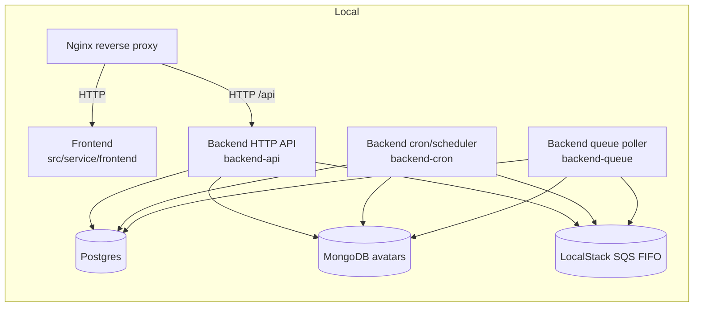
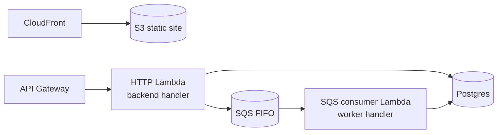

# 런타임 토폴로지

이 문서는 로컬 개발 환경과 AWS 환경에서 코드가 어디에서 실행되고, 각 구성요소가 어떻게 연결되는지 소개합니다.

 
 

## 로컬 토폴로지

로컬 개발에서는 Docker Compose로 보조 서비스와 애플리케이션(백엔드/프론트엔드)을 함께 구동합니다.

`backend-api`, `backend-cron`, `backend-queue` 같은 역할(role)은 동일한 백엔드 코드베이스를 환경변수로 분기해 실행하는 형태로 구성됩니다.

User avatar 경로는 다중 저장소 예시이며, 문서의 핵심은 Application이 포트에만 의존하고 Infrastructure가 구현체를 제공하는 DIP 구조입니다.

### 역할 분기 스위치

역할은 코드 복제가 아니라 런타임 플래그로 분기합니다.

- `PORT_LISTEN`: HTTP 리스닝 활성화 여부
- `OUTBOX_CRON_ENABLED`: outbox 스케줄러 활성화 여부
- `OUTBOX_POLLING_ENABLED`: SQS poller 활성화 여부

핵심은 "역할별 진입점만 다르게" 하고, Application/Domain 경계는 동일하게 재사용하는 것입니다.

 
 

## AWS 토폴로지(개념)

AWS에서도 역할은 유사하며, API Gateway/Lambda/SQS로 매핑됩니다.

 
 

## 실행 정책

- HTTP, cron, queue 역할은 진입점만 다르고 도메인 규칙은 동일한 경계를 사용합니다.
- cron/worker는 내부 구현을 직접 우회 호출하지 않고 Command/Query Bus 경계를 통해 유스케이스를 실행합니다.
- 이 정책은 역할 분리가 커져도 애플리케이션 핵심 로직의 일관성을 유지하기 위한 기본 규칙입니다.

### 경계 관점 요약

- 런타임 분기 정책은 `main`/`runtime-role` 같은 진입점 계층에서만 결정합니다.
- 도메인 정책 변경은 역할 플래그와 무관하게 동일한 Handler/Entity 경로를 통과해야 합니다.
- 즉, 운영 토폴로지가 변해도 클린 아키텍처의 의존성 방향은 고정됩니다.
